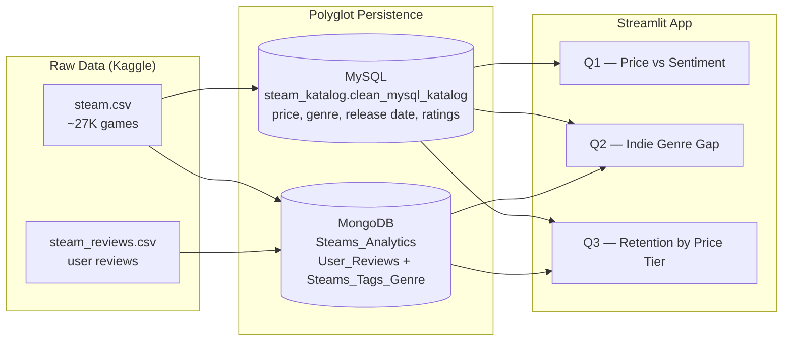

# Steam Analytics OLAP Dashboard

**Group project** — an interactive analytics dashboard built on top of the [Steam Store Games](https://www.kaggle.com/datasets/nikdavis/steam-store-games) and [Steam Reviews](https://www.kaggle.com/datasets/andrewmvd/steam-reviews) datasets from Kaggle. The project explores a **polyglot persistence** setup — structured catalog data lives in MySQL while unstructured, high-volume review text lives in MongoDB — and uses Streamlit as a live query layer that joins both stores to answer business questions about pricing, indie genre strategy, and player retention.

## Problem / Business Question

Indie titles make up the majority of new releases on Steam every year, but most never build a lasting player community. **What makes some indie games retain active, engaged communities after launch while most don't — and what can genre and pricing choices tell us about that?**

We break this into three connected questions:
1. **Does price predict player sentiment?** (catalog-wide, all 27K games — the pricing context every developer, indie or not, operates in)
2. **Where is the indie market over-saturated, and which under-served genres are actually rated better?** (indie-specific, via SteamSpy community tags)
3. **Do higher-priced games keep their review communities active longer after release?** (retention window per price tier, across the sampled review dataset)

Individually each question is answerable from a single store — sentiment ratios from MySQL, tags and reviews from MongoDB — but the interesting answers only emerge by joining both.

## Overview

Steam's catalog (price, genre, release date, developer) is naturally tabular and changes rarely — a good fit for a relational schema. User reviews, on the other hand, are high-volume, loosely structured, and arrive continuously — a better fit for a document store. Rather than forcing both into one engine, this project keeps each dataset in the database that suits it best and combines them at query time:

- **MySQL** (`steam_katalog.clean_mysql_katalog`, ~27,000 rows) — structured game catalog: appid, name, price, release date, developer/publisher, and aggregate positive/negative rating counts.
- **MongoDB** (`Steams_Analytics`) — unstructured review data:
  - `User_Reviews` — individual user review documents (recommendation flag, playtime, review timestamp)
  - `Steams_Tags_Genre` — per-game SteamSpy community tags (genres, including the "Indie" tag)
- **Streamlit + Plotly** — the application layer. Each business question queries both databases, joins the results on `appid` with pandas, and renders interactive charts.

## Team & Contributions

This is a 3-person group project. Roles:

| Member | Focus |
|---|---|
| **Leo** (repo owner) | Problem framing & business questions, dataset sourcing and cleaning (Kaggle → `Dataset Clean/`), polyglot persistence architecture reasoning (why MySQL vs. MongoDB per data type), database schema & ETL design |
| **Frederick** | Streamlit dashboard implementation, chart/interaction design |
| **Ariel** | Statistical modeling & analysis behind the business questions |

## Architecture



## Business Questions & Key Findings

### Q1 — Price vs Sentiment
**Question:** At which price range do games tend to have the highest positive review ratio? Is Free-to-Play received better than paid games?

**Source:** `price`, `positive_ratings`, `negative_ratings` from MySQL — all 27,061 games with at least one rating.

**Findings:**
| Price bucket | Games | Avg positive ratio |
|---|---|---|
| Free | 2,556 | 71.9% |
| $0–5 | 13,286 | **68.4%** (lowest) |
| $5–15 | 9,243 | 74.9% |
| $15–30 | 1,653 | **75.5%** (highest) |
| $30+ | 323 | 71.9% |

Games in the **$5–$15 and $15–$30** range have the highest positive ratios — a "fair value" sweet spot. Interestingly, the **$0–5 bucket scores lowest**, despite being the largest single bucket by game count — likely reflecting the high volume of low-effort/shovelware titles at that price point.

### Q2 — Indie Genre Gap
**Question:** Which genre combinations are most over-produced by indie developers (2016–2021), and which genres are under-served but consistently well-rated?

**Source:** Games tagged `"Indie"` in MongoDB `Steams_Tags_Genre`, released 2016–2021, joined to MySQL sentiment via `appid`.

**Findings:**
- **Action** (5,584 games) and **Casual** (4,979 games) dominate indie production volume — low barrier to entry with modern engines (Unity/Godot/Unreal).
- Niche genres are far less crowded but rate much higher: **Sokoban** (98.5%, 5 games), **Turn-Based Strategy** (93.9%, 8 games), **Puzzle** (82.3%, 627 games).

This is the "Indie Genre Gap": developers cluster around popular, broad genres, but player satisfaction doesn't follow volume — niche genres with smaller, more specific audiences tend to have their expectations met more consistently.

### Q3 — Retention by Price Tier
**Question:** Do higher-priced games keep their review communities active longer after release?

**Source:** MongoDB `User_Reviews.timestamp_created` → retention window = `last_review_date − release_date` (MySQL), joined via `appid`. Limited to games with at least 10 reviews.

**Findings (82 games analyzed):**
| Price tier | Avg retention (days) |
|---|---|
| $5–$15 | **2,190** (highest) |
| $0–$5 | 1,510 |
| $15–$30 | 1,289 |
| $30+ | **1,056** (lowest) |

Mid-priced games ($5–$15) keep their communities discussing them the longest, while premium ($30+) titles see the shortest active review windows in this sample — suggesting price alone doesn't drive long-term community engagement; game quality and genre likely matter more.

<!-- screenshot: dashboard-overview -->

## Tech Stack

- **Frontend:** Streamlit, Plotly
- **Structured store:** MySQL 9.7
- **Unstructured store:** MongoDB 7
- **Data access:** pandas, SQLAlchemy + PyMySQL, PyMongo, python-dotenv
- **Infrastructure:** Docker Compose (MySQL + MongoDB + one-shot ETL container)

## Project Structure

```
.
├── app.py                      # Streamlit app (3 tabs, one per business question)
├── analysis/
│   ├── q1_price_sentiment.py   # MySQL-only: price bucket vs positive ratio
│   ├── q2_indie_gap.py         # MongoDB tags + MySQL sentiment: indie genre gap
│   ├── q3_retention.py         # MongoDB reviews + MySQL release date: retention
│   ├── q4_developer_stats.py   # Derived MySQL table: per-developer stats
│   └── q5_sentiment_summary.py # Derived MongoDB collection: per-game sentiment summary
├── db/
│   ├── config.py                # Shared MySQL/Mongo connection config, loaded from .env
│   ├── mysql_conn.py            # legacy standalone MySQL check, unused by app.py
│   └── mongo_conn.py            # legacy standalone Mongo check, unused by app.py
├── etl/                         # One-shot ETL container (raw CSV -> MySQL + MongoDB)
├── Dataset Clean/               # Pre-cleaned CSV exports
├── Dataset Raw/                 # Put downloaded Kaggle CSVs here (gitignored)
├── docker-compose.yml
└── .env.example
```

<!-- screenshot: q1-price-sentiment -->
<!-- screenshot: q2-indie-genre-gap -->
<!-- screenshot: q3-retention -->

## Setup & Run

### 1. Prerequisites
- Docker + Docker Compose
- Python 3.11

### 2. Get the raw datasets
Download from Kaggle and place into `Dataset Raw/` (flat files, not zipped):
- [Steam Store Games](https://www.kaggle.com/datasets/nikdavis/steam-store-games) → `Dataset Raw/steam.csv`
- [Steam Reviews](https://www.kaggle.com/datasets/andrewmvd/steam-reviews) → `Dataset Raw/steam_reviews.csv`

> `steam_reviews.csv` is ~8GB. The ETL only samples a subset of it (see `etl/run_etl.py`), so the import is fast even though the source file is large.

### 3. Configure environment
```bash
cp .env.example .env
```
Set your own `MYSQL_ROOT_PASSWORD` in `.env`. All connection strings are built at runtime from these values via `db/config.py` (python-dotenv) — no credentials are hardcoded in source. `.env` is gitignored and must never be committed.

### 4. Spin up the databases and run the ETL
```bash
docker-compose up -d
```
This starts MySQL and MongoDB, waits for both to be healthy, then runs a one-shot ETL container that:
- loads the cleaned game catalog (with ratings) into `steam_katalog.clean_mysql_katalog`
- builds `Steams_Analytics.Steams_Tags_Genre` from SteamSpy tags
- samples `Steams_Analytics.User_Reviews` from `steam_reviews.csv`

Check ETL progress with:
```bash
docker logs -f steam-etl
```

### 5. Run the app
```bash
pip install -r requirements.txt
streamlit run app.py
```

The app will be available at `http://localhost:8501`.
